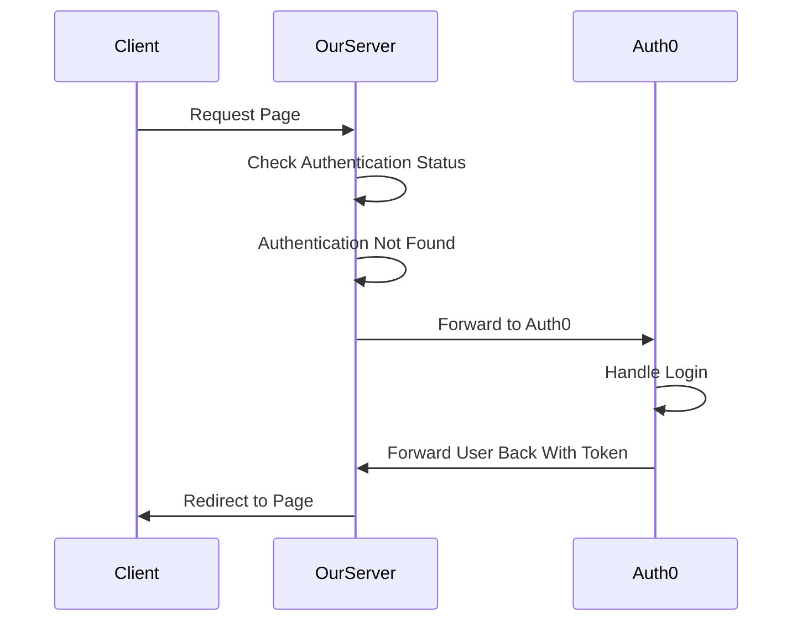

# Authentication and Auth0

## Safely Storing Passwords

When a user registers or sets a password, it is crucial to store it securely. Instead of storing passwords directly, we use a process called hashing. Hashing converts a password into a fixed-length string of characters using a cryptographic algorithm. The resulting hash is unique to the input password, making it hard to reverse-engineer the original password. Not al hashing algorithms are equally secure - some algorithms are susceptible to what are called 'collisions', where two inputs can produce the same hash value. The longer the hash that is generated, the lower the probability of experiencing collisions - simple probability theory. However, hashing alone is not enough to protect against potential attacks like dictionary attacks or rainbow table attacks where a precomputed list of password hashes (the rainbow table) is compared to a stolen database.

To enhance security, web applications also use salting. Salting involves adding a random string of characters (salt) to the password before hashing it. The salt is unique per user and stored alongside the hashed password. This makes it much harder for attackers to crack the passwords using rainbow tables, as the hashes in the rainbow table must be recalculated to account for the salt.

## Cookies

Cookies are small pieces of data stored on a user's browser. They are commonly used for session management and authentication. When a user logs in, the server generates a unique session identifier and sends it to the client as a cookie. The client then includes this cookie in subsequent requests to the server. The server validates the session identifier to grant access to the requested resources.

## JSON Web Tokens (JWTs)

JWTs are a popular method for authentication in web applications. They are self-contained, digitally signed tokens that contain user identity information. JWTs are encoded and consist of three parts: header, payload, and signature. The header specifies the hashing algorithm used, the payload includes user information, and the signature ensures the token's integrity.

When a user logs in, the server generates a JWT and sends it to the client. The client includes the JWT in subsequent requests as an Authorization header or within a query parameter. The server then verifies the JWT's signature, ensuring its authenticity, and extracts the user information from the payload.

## Encryption

Digital signing uses asymmetric encryption. This is a fascinating topic that underpins all of digital security, including digital identity, Web3/blockchain technology, and financial services.

### Public and Private Keypairs

Public and private keypairs are generated together and are mathematically linked. They are used in asymmetric encryption to perform different operations.

The fundamental property of asymmetric encryption is that data encrypted with a public key can only be decrypted with the corresponding private key, and vice versa.

#### Public Key

The public key is intended to be shared openly with anyone who wants to communicate securely with the key owner. It is used to encrypt data or verify digital signatures. Public keys are generally available to the public and can be freely distributed.

As a side note, the 'address' used in blockchain technology is actually a public key.

#### Private Key

The private key, as the name suggests, is kept secret and known only to the key owner. It is used to decrypt data encrypted with the corresponding public key or to generate digital signatures. Private keys must be securely stored and should never be shared with anyone. Private keys may also themselves be encrypted and require a passphrase in order to use the actual key. This makes it so that an attacker must both know your passphrase and have access to the private key.

As another side note, when you perform an operation on a blockchain you are using the private key that corresponds to the public key that is your wallet address. A 'hot' wallet is a private key that is stored on a machine so that it can be actively used for performing operations. A 'cold' wallet is one where the private key is stored offline, so that it cannot be compromised digitally and must be physically stolen. This is possible because it is the signed output that must be broadcast to the network - they already have the public key that they can use to verify the transaction. It is possible to generate a valid transaction doing the math by hand and typing in the right numbers.

### Encrypting Data

In asymmetric encryption, the public key is used to encrypt data. When a sender wants to send a message to a specific recipient, they use the recipient's public key to encrypt the message. Once encrypted, only the recipient with the corresponding private key can decrypt and read the message.

This process provides confidentiality and ensures that only the intended recipient can access the message. Even if the encrypted message is intercepted during transmission, it remains secure as only the private key holder can decrypt it.

### Signing Data

Asymmetric encryption is also used for digital signatures. A digital signature provides integrity and authenticity to data, ensuring that it has not been tampered with and verifying the identity of the sender.

To sign data, the sender uses their private key to generate a unique digital signature for the data. The recipient can then use the sender's public key to verify the signature. If the signature is valid, it confirms that the data was not modified during transmission and that it was indeed sent by the holder of the private key.

## Methods for Transmitting Authentication Info

Authentication methods can vary based on how the authentication data is sent. The three common methods are:

### Query Parameter

The authentication data is appended to the URL as a query parameter. For example: https://example.com/resource?token=123456789.

### Authorization Header (Bearer Token)

The authentication data is sent in the Authorization header using the Bearer token scheme. For example: Authorization: Bearer 123456789.

### Cookies

The authentication data is stored in cookies, as discussed earlier. The client automatically includes the cookie in subsequent requests, eliminating the need to explicitly send authentication data. Note that cookies cannot be accessed across domains. A cookie set by auth0.com cannot be read by utdallas.edu, for security reasons. One of the other two methods must be used for cross domain authentication, and this is where the next section comes in.

## Auth0 and OAuth

All of the above is about how to implement an authentication system. At EPICS, we use Auth0 to handle the implementation of authentication. This also lets us easily use integrations such as sign in with a Google or Microsoft account via the OAuth protocol. Essentially, we rely on a third party to handle the storage and validation of authentication methods, and we only need to verify that a token we receive has been signed by our third party provider.



An important thing to note here is that the user is NOT logging in to us, they are instead logging into Auth0. Specifically, they are logging into our Auth0 Tenant, which is a specific instance that Auth0 hosts for us. Auth0 then sends us a token, which we verify using the public key for our Tenant.

This is straightforward to implement ourselves, as we need only the following API routes (SPA handling is different):

- login: redirects user to the auth0 login page
- logout: redirects user to the auth0 logout page, which will automatically redirect them to....
- logout-complete: clear our cookies/auth storage
  This is with SSR, where we can conveniently store the token as a cookie and access it both server and client side.

If we are doing an SPA, the client side library will handle all the redirects and we simply need to worry about sending the token or saving it to cookies.

We also need some form of middleware function to handle verifying authenticity of the login token. In SSR, this middleware will be serverside, and will often run on every request. You can use this middleware to annotate incoming requests with information such as user profiles, roles, database clients, etc. SPAs can also guard the navigation routes clientside by checking authentication status, although this DOES NOT protect the API.

An example of verifying a token:

```js

import jwt from 'jsonwebtoken';
import { loginRedirectUrl } from '../auth0';
try {
    // get the 'claims', information about who the user is
    // claiming to be. this is also where we verify the signature
    const claims = jwt.verify(
      token,
      // this here loads the public key of our instance from a file on disk
      fs.readFileSync((runtime.CERT_PATH as string) || './cert-dev.pem')
    );
    // no error thrown, token is valid
    event.context.claims = claims;
    event.context.user = await event.context.client.findFirst({
      where: {email: claims.email,}
    });
  } catch (e) {
    // token may be malformed or expired, so clear cookies
    // and redirect them to auth0 login
    console.error(e);
    setCookie(event, 'token', '');
    return await sendRedirect(event, loginRedirectUrl());
  }
```
