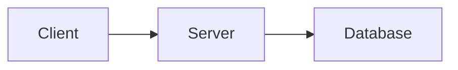
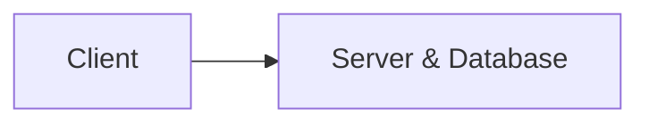
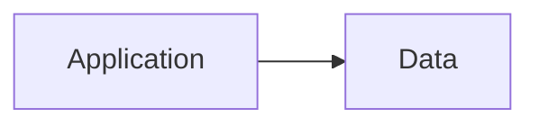
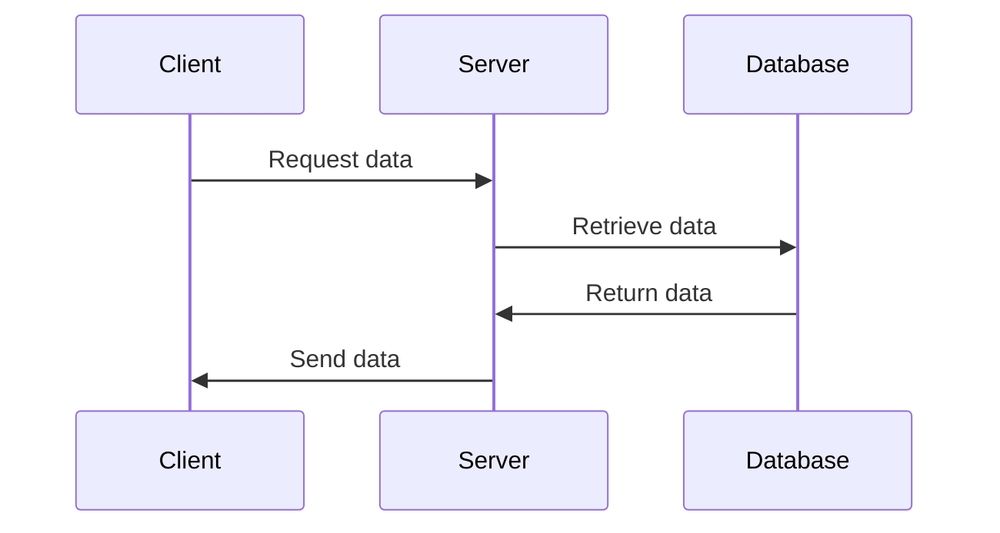

# Data Flow in Networked & Local Applications

## Server and Database on Separate Machines



In this diagram, the client sends a request to the server, which then communicates with the database on a separate machine to retrieve or update the data.

## Server and Database on the Same Machine



In this diagram, both the server and the database are running on the same machine. The client sends a request to the server, which directly accesses the database on the same machine to handle the request.

## Local Application Accessing Local Data



In this diagram, there are two separate boxes representing the application and the data on the same machine. The local application directly accesses the local data without any network communication.

## Client-Server-Database Communication

In the following diagram, the client initiates the data flow by sending a request to the server. The server then retrieves the requested data from the database. Once the database returns the data to the server, the server sends it back to the client.



## Making Network Requests in JavaScript

> Note from Taz: make sure to review [the notes on async/await](../languages_and_frameworks/webdev_pathway.md#asyncawait--promises)

```javascript
async function fetchData() {
  try {
    // by default a request will be a GET request.
    const response = await fetch("https://api.example.com/data");
    const data = await response.json();

    // Use the retrieved data here
    console.log(data);
  } catch (error) {
    // Handle any errors that occurred during the request
    console.error(error);
  }
}
```

This example is generally used solely to retrieve data from a server. In order to send data, we can use either a POST or a PUT request depending on what kind of operation we are performing. POST requests generally imply creation of something, and PUT requests generally imply updating something.

The following example demonstrates how we would use the fetch API to send a POST request containing JSON.

```js
async function postData() {
  try {
    const url = "https://api.example.com/data";
    const data = {
      name: "John Doe",
      age: 25,
      email: "johndoe@example.com",
    };

    const response = await fetch(url, {
      method: "POST",
      headers: {
        "Content-Type": "application/json",
      },
      body: JSON.stringify(data),
    });

    if (response.ok) {
      const responseData = await response.json();
      console.log(responseData);
    } else {
      throw new Error("Request failed with status " + response.status);
    }
  } catch (error) {
    // Handle any errors that occurred during the request
    console.error(error);
  }
}
```

Using network requests in React or Next requires special considerations as they must be wrapped in useEffect if they are going to be fetching data after the component has rendered, such as on mount of the component. Usage in Vue and Nuxt is straightforward, essentially the same as in vanilla JavaScript, but Nuxt gives us some extra quality of life features, such as useFetch for loading data with automatic serverside support and $fetch as a more convenient wrapper for fetch.

> Note from Taz: you CANNOT use async inside of a `useEffect`. You have to define an async function inside the `useEffect` that does what you want with whatever `await`s you need inside of the function, and then call it inside the `useEffect`. In Vue, you can use `await` anywhere except a `computed`.

An example for sending data in React:

```js
import React, { useState } from "react";

function MyComponent() {
  const [formData, setFormData] = useState({ name: "", email: "" });
  const [responseData, setResponseData] = useState(null);

  const handleSubmit = async e => {
    e.preventDefault();

    try {
      const response = await fetch("https://api.example.com/data", {
        method: "POST",
        headers: {
          "Content-Type": "application/json",
        },
        body: JSON.stringify(formData),
      });
      const data = await response.json();
      setResponseData(data);
    } catch (error) {
      console.error(error);
    }
  };

  const handleInputChange = e => {
    setFormData({ ...formData, [e.target.name]: e.target.value });
  };

  return (
    <div>
      <form onSubmit={handleSubmit}>
        <input
          type="text"
          name="name"
          value={formData.name}
          onChange={handleInputChange}
        />
        <input
          type="email"
          name="email"
          value={formData.email}
          onChange={handleInputChange}
        />
        <button type="submit">Submit</button>
      </form>
      {responseData && <div>Response: {JSON.stringify(responseData)}</div>}
    </div>
  );
}
```

The same example in Vue:

```html
<template>
  <div>
    <form @submit="handleSubmit">
      <input type="text" v-model="formData.name" />
      <input type="email" v-model="formData.email" />
      <button type="submit">Submit</button>
    </form>
    <div v-if="responseData">Response: {{ responseData }}</div>
  </div>
</template>

<script setup>
  import { ref } from "vue";

  const formData = ref({ name: "", email: "" });
  const responseData = ref(null);

  const handleSubmit = async e => {
    e.preventDefault();

    try {
      const response = await fetch("https://api.example.com/data", {
        method: "POST",
        headers: {
          "Content-Type": "application/json",
        },
        body: JSON.stringify(formData.value),
      });
      const data = await response.json();
      responseData.value = data;
    } catch (error) {
      console.error(error);
    }
  };
</script>
```

Next and Nuxt provide mechanisms for fetching the required data before a page is sent to the client. This is called server-side rendering, where the server will make any database calls it can before sending the page so that the client does not have to make extra requests after loading the page. This also enables Search Engine Optimization (SEO) for the content, as search engines will be able to index the content when the page loads. For details on these mechanisms, checkout the relevant documentation for [Nuxt](https://nuxtjs.org/guide/features/fetch) and [Next](https://nextjs.org/docs/pages/building-your-application/data-fetching) websites.

For more information on using the fetch API, see the [corresponding MDN pages](https://developer.mozilla.org/en-US/docs/Web/API/Fetch_API/Using_Fetch).

## Making Network Requests in Python

Below is another example of making a POST request, but in Python.

```python
import requests
import json

def post_data():
    try:
        url = 'https://api.example.com/data'
        data = {
            'name': 'John Doe',
            'age': 25,
            'email': 'johndoe@example.com'
        }
        headers = {
            'Content-Type': 'application/json'
        }

        response = requests.post(url, data=json.dumps(data), headers=headers)

        if response.ok:
            response_data = response.json()
            print(response_data)
        else:
            response.raise_for_status()

    except requests.exceptions.RequestException as error:
        # Handle any errors that occurred during the request
        print(error)
```

For more information on making requests in Python, see the [requests documentation.](https://requests.readthedocs.io/en/latest/)

## Structure of an URL

