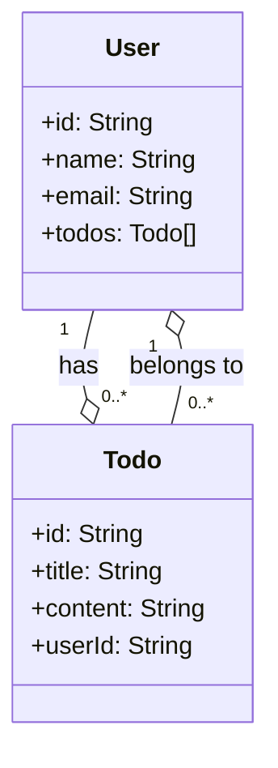

Some of these tutorials may use Sublime, or Atom - it is STRONGLY recommended that you use vscode.
Some of these may use MongoDB. DO NOT USE MONGODB. Instead, use Prisma and either PostgreSQL or MySQL.
Some of these use React/Next. We STRONGLY reccommend Vue/Nuxt over React/Next.

Breaking out of just reading tutorials
https://www.codewell.cc/blog/how-to-escape-tutorial-hell-and-start-building-your-own-projects

The Odin Project
https://www.theodinproject.com/paths/full-stack-javascript

CSS for absolute beginners
https://www.youtube.com/watch?v=yfoY53QXEnI

Visual guide to CSS Selectors
https://fffuel.co/css-selectors/

JS Crash Course
https://www.youtube.com/watch?v=hdI2bqOjy3c

CSS Grid
https://scrimba.com/learn/cssgrid

CSS Flexbox
https://www.youtube.com/playlist?list=PLC3y8-rFHvwg6rjbiMadCILrjh7QkvzoQ

HTML for absolute beginners
https://www.youtube.com/watch?v=UB1O30fR-EE

Overview of the Chrome DevTools - note that every browser engine (Firefox, Chrome/Chromium, Safari) has it's own equivalent
https://developer.chrome.com/docs/devtools/

NodeJS
For the API section: Express
Database section: Prisma + Postgresql
Testing: Vitest
https://roadmap.sh/nodejs

Vue Roadmap
https://roadmap.sh/vue
https://vuejs.org

JS Overview
https://javascript.info

JS Roadmap
https://roadmap.sh/javascript

# Creating a Webpage with CSS, HTML, and JS

Prerequisites:

- VSCode/VSCodium (or text editor of choice)
- Familiar with CLI - navigating to folders, running commands
- Python (should still come preinstalled on macOS, may need to upgrade to python 3)

## Serving a website/webapp

Web content is delivered to the users browser from the server via HTTP/HTTPS. We can achieve this in our local dev environment in several ways. Here we look at directly opening a file and using pythons http.server module.

### Create an HTML file

1. Open a text editor and create a new file called index.html
2. Add the following HTML:

```html
<html>
  <head>
    <title>My Page</title>
  </head>
  <body>
    <h1>Hello World!</h1>
    <p>This is my web page.</p>
  </body>
</html>
```

3. Save the file

### View in browser

1. Open your web browser (Chrome, Firefox etc)
2. Go to File > Open File
3. Select the index.html file you just created
4. The web page with "Hello World!" text will open

#### Serve with Python

1. Open terminal/command prompt
2. Navigate to directory containing index.html
3. Run:
   `python -m http.server 8000`

4. Open browser and go to http://localhost:8000
5. You will see your index.html rendered
6. Press Ctrl+C in terminal to stop the server

## Creating and styling elements

### Add HTML elements

In index.html:

```html
<div class="header">
  <h1>My Website</h1>
  <nav>
    <a href="#">Link 1</a>
    <a href="#">Link 2</a>
    <a href="#">Link 3</a>
  </nav>
</div>

<div class="content">
  <div class="card">
    <h2>Card Title</h2>
    <p>This is some card content</p>
  </div>

  <div class="card">
    <h2>Another Card</h2>
    <p>Some content for this card</p>
  </div>
</div>
```

### CSS Tags

CSS can go in two places. `<style></style>` tags can contain class definitions. You can also write the rules for an element directly in the `style` attribute of any HTML element.

```html
<style>
  /* this all needs to be valid CSS - also this is how you do comments in CSS */
  /* this is a css class */
  .example {
    /* this is a 'rule' */
    padding: 50px;
  }
</style>
<!-- example of an HTML comment, and the next line is an example of providing styles via style attribute -->
<p style="background-color: red; color: blue;"></p>
<div class="header">
  <h1>My Website</h1>
  <nav>
    <a href="#">Link 1</a>
    <a href="#">Link 2</a>
    <a href="#">Link 3</a>
  </nav>
</div>

<div class="content">
  <div class="card">
    <h2>Card Title</h2>
    <p>This is some card content</p>
  </div>

  <div class="card">
    <h2>Another Card</h2>
    <p>Some content for this card</p>
  </div>
</div>
```

### Grid Layout

The grid layout allows elements to be organized in rows and columns:

```css
.content {
  display: grid;
  grid-template-columns: 1fr 1fr;
}
```

### Flexbox Layout

Flexbox allows responsive alignment using flex properties:

```css
.header {
  display: flex;
  align-items: center;
}
```

This by default will render as a horizontal row. You can make it vertical with `flex-direction: column;`

### Block Layout

This is the default display mode.

Block displays elements stacked vertically, at full width:

```css
.card {
  display: block;
}
```

### Styling and Transitions

```css
.header {
  background: #eee;
  padding: 20px;
}

.card {
  background: white;
  border: 1px solid #ddd;
  padding: 20px;
  transition: box-shadow 0.3s;
}

.card:hover {
  box-shadow: 0 0 10px rgba(0, 0, 0, 0.2);
}
```

## Brief discussion of JS

There will be words here that you are not familiar with - look them up or ask!

### Vanilla JS

- JS was created in 1995 to add dynamic interactivity to web pages
- Early JS was simple scripts that manipulated the DOM (Document Object Model)
- Issues with loading complex projects due to async fetching
- Kinda hacky/janky, but in a lovable way

### jQuery

- jQuery was released in 2006 and quickly became popular
- It simplified DOM manipulation, AJAX (network calls), events etc with easy-to-use methods
- Still no guarantee an import will exist by the time it needs to be executed

### JS Frameworks

- AngularJS (2010) and other frameworks emerged to manage code complexity
- React (2013) and Vue (2014) provided component architectures
- Allowed building complex SPAs efficiently
- Two-way data binding
- Markup languages other than HTML such as Pug and JSX

### Bundlers like Webpack/Rollup

- As apps grew, bundling tools like Webpack were needed
- They bundle JS modules and assets into optimized files
- Enables features like code splitting for efficient delivery
- Solve the issues of async asset loading in browsers

### Meta Frameworks

- Next.js (2016) and Nuxt (2017) built on React and Vue
- Provide server-side rendering, routing, optimizations
- Complete framework for building web applications
- Deeper integration between frontend and backend code

The progression has been towards more powerful abstractions to manage complexity and enable faster development.

### JSON (JS Object Notation)

- JSON is a text-based format for representing structured data
- Based on JS object syntax, available for all major languages
- JSON uses key-value pairs, arrays, and objects to store data
- Keys and strings are enclosed in double quotes
- JSON is very machine AND human readable
- JSON is lightweight and more compact than alternatives like XML
- JSON data is transmitted as plain text, MIME type application/json
- Can be converted to/from native JS objects

### Node.js

- Node.js allows running JS on the server
- Having one language across the full stack simplifies a lot of things

```js
// Load HTTP module
const http = require("http");

// Create server
const server = http.createServer((req, res) => {
  // Handle request
});

// Listen on port
server.listen(3000);
```

### Express

- Express is a web framework for Node.js
- Makes it easier to build web apps and APIs

```js
// Load express
const express = require("express");

// Create app
const app = express();

// Handle GET request
app.get("/api/items", (req, res) => {
  // Return JSON response
  res.json([{ id: 1 }, { id: 2 }]);
});

// Listen on port
app.listen(3000);
```

### REST APIs

- REST APIs provide data via HTTP endpoints
- Express allows building REST APIs simply
- Route parameters - extract parts of an URL to use as variables
- Query parameters - https://example.com/?queryParam1=value&queryParam2=5
- Body - GET requests by convention do not allow a body, must use route/query parameters

```
GET /api/items - get items
POST /api/item - create item
PUT /api/item/1 - update item with id 1
DELETE /api/item/1 - delete item with id 1
```

### Network calls using fetch

Making a GET request:

```js
async function getMovies() {
  const response = await fetch("http://example.com/movies.json");
  const data = await response.json(); // this reads the body of the response into a JSON object

  console.log(data);
}

getMovies();
```

Note that with GET requests, you _should not_ provide a request body. Pass information along in the query parameters, which the server can extract and use.

````js
async function getMovies() {

  // Add query parameters
  const queryParams = '?limit=10&genre=action';

  const response = await fetch('http://example.com/movies.json' + queryParams);

  const data = await response.json();

  console.log(data);

}

getMovies();```

Making a POST request:
``` js
async function addMovie() {
  const response = await fetch('http://example.com/movies', {
    method: 'POST',
    body: JSON.stringify({title: 'Star Wars'}) // note that the body MUST be a string
  });

  const data = await response.json();

  console.log(data);
}

addMovie();
````

DELETE and UPDATE requests work in the same way as POST.

## Use JS to interact with users

### Add button and text input

In HTML:

```html
<button id="increment">Increment</button>

<input id="nameInput" type="text" />

<p>Counter: <span id="counter">0</span></p>

<p>Name: <span id="name"></span></p>
```

### JS

JS will always go inside of a `<script></script>` tag. It can be loaded over network or be written directly inside the tag.

`<script src="https://path/to/js/file"></script>` will load a specific file over network.

An example inside a script tag:

```html
<script>
  console.log("this is javascript");
</script>
```

Add the following to the above HTML:

```js
// Get elements
/* these are javascript objects that represent elements in the page itself  */
const incrementBtn = document.getElementById("increment");
const nameInput = document.getElementById("nameInput");
const counterEl = document.getElementById("counter");
const nameEl = document.getElementById("name");

// Increment counter on click
let counter = 0;
/* this will run the function when the element emits the 'click' event - elements have a bunch of events they can emit */
incrementBtn.addEventListener("click", () => {
  // this is an arrow function
  counter++;
  counterEl.textContent = counter;
});

// Update name on input change
nameInput.addEventListener("input", () => {
  nameEl.textContent = nameInput.value;
});
```

# Creating a project with a JS framework

## A simple Single Page Application with Vue

TODO: compare/contrast event listeners + dom vs two way data binding

TODO: need to go over project setup

TODO: npm vs pnpm vs yarn

`npm install vue@next pug typescript`

### App.vue

```vue
<script setup lang="ts">
import LearningExamples from "./components/LearningExamples.vue";
</script>

<template lang="pug">
#app
  LearningExamples  
</template>
```

### LearningExamples.vue

```vue
<script setup lang="ts">
import { ref } from "vue";

const counter = ref<number>(0);
const name = ref<string>("");

const increment = () => {
  counter.value++;
};
</script>

<template lang="pug">
div 
  button(@click="increment") Increment
  input(v-model="name")
  p Counter: {{ counter }}
  p Name: {{ name }}  
</template>
```

You should be able to figure out how to use CSS to make the above examples look nice.

## Using a server & database

### Prisma

Prisma is an open-source ORM for Node.js and TypeScript. It provides a type-safe database client auto-generated from a data model. It also has features for managing the database schema and handling migrations.

- Declarative data modeling using schema.prisma
- Auto-generated and type-safe database client
- Query building and validation
- Database migrations
- Works with all major databases

### Express & H3

H3 does have some provided database adapters, however we want to leverage Prisma's additional schema management features.

### Example Prisma schema

Key points:

- The datasource block defines a PostgreSQL database connection.
- The generator block specifies we want a Prisma Client JS library generated.
- User model has name, email, and a relation to Todo items. id is generated with cuid().
- Todo model has title, optional content, and a relation to User via the userId foreign key.
- The @relation and @references directives establish the 1:M relationship between User and Todo.

```prisma
datasource db {
  provider = "postgresql"
  url      = env("DATABASE_URL")
}

generator client {
  provider        = "prisma-client-js"
}

model User {
  id    String @id @default(cuid())
  name  String
  email String @unique
  Todos Todo[] // one to many relationship: one user has many Todos
}

model Todo {
  id     String @id @default(cuid())
  title  String
  content String?
  userId String
  User   User @relation(fields: [userId], references: [id]) // other side, many to one relationship: one Todo belongs to one User
}
```

Corresponding class diagram



### Example Express implementation

```js
// user routes elided for brevity
const express = require("express");
const { PrismaClient } = require("@prisma/client");

const prisma = new PrismaClient();
const app = express();

app.use(express.json());

// Create todo
app.post("/todos", async (req, res) => {
  const todo = await prisma.todo.create({
    data: {
      title: req.body.title,
      content: req.body.content,
      user: { connect: { id: req.body.userId } },
    },
  });
  res.json(todo);
});

// Update todo
app.put("/todos/:id", async (req, res) => {
  const todo = await prisma.todo.update({
    where: { id: req.params.id },
    data: req.body,
  });
  res.json(todo);
});

// Get all todos
app.get("/todos", async (req, res) => {
  const todos = await prisma.todo.findMany();
  res.json(todos);
});

// Get single todo
app.get("/todos/:id", async (req, res) => {
  const todo = await prisma.todo.findUnique({
    where: { id: req.params.id },
  });
  res.json(todo);
});

app.listen(3000, () => {
  console.log("Server started on http://localhost:3000");
});
```

### Example H3 implementation

```ts
// user routes elided for brevity
import { createApp } from "@h3/app";
import { readBody } from "@h3/composables";
import { PrismaClient } from "@prisma/client";
const prisma = new PrismaClient();
const app = createApp();
// Todo Routes

app.post("/todos", async event => {
  const body = await readBody(event);

  return prisma.todo.create({
    data: {
      title: body.title,
      content: body.content,
      user: { connect: { id: body.userId } },
    },
  });
});

app.get("/todos", async () => {
  return prisma.todo.findMany();
});

app.get("/todos/:id", async event => {
  return prisma.todo.findUnique({
    where: { id: event.params.id },
  });
});

app.put("/todos/:id", async event => {
  const body = await readBody(event);

  return prisma.todo.update({
    where: { id: event.params.id },
    data: body,
  });
});

app.delete("/todos/:id", async event => {
  return prisma.todo.delete({
    where: { id: event.params.id },
  });
});
```

# Databases

A database is a structured collection of data stored in a computer system. Databases allow you to efficiently store, organize, and query large amounts of data.

The data in a database is organized into tables, with rows representing individual records or items, and columns representing the attributes of each item. For example, a table storing customer data might have columns for name, address, phone number, etc.
To retrieve or manipulate data in a database, you use a query language like SQL (Structured Query Language). SQL allows you to write queries to select specific data, filter rows, join tables, update records, and more. Non-technical users can interact with a database through a custom frontend application.

There are two main types of database models:

- SQL databases are relational databases, where data is structured in relations (tables) and data has relationships between tables. SQL databases use SQL and are optimized for complex queries. Examples are MySQL, Oracle, SQL Server.
- NoSQL databases have flexible, non-tabular data models. They are optimized for scalability and high performance on large volumes of data. But they sacrifice some functionality of relational SQL models. Examples are MongoDB, Cassandra, Redis.

SQL databases are better for complex queries, relationships between data, and data consistency. NoSQL is better for simplicity of design, handling big data, and flexibility. Most real-world systems use a mix of SQL and NoSQL databases as needed. For example, a SQL database to store core business data, and a NoSQL cache layer to quickly serve common queries.

Generally speaking you will end up with an SQL server for your core schema, and Redis, Memcached, or some other key-value store for your caching layer, if you even need one - in some cases you don't need a database cache, you can simply write to static files use a CDN like Cloudfront or Fastly.

You will almost never really need to reach for something like MongoDB outside of specific use cases that you will _not_ encounter at the scale of an EPICS project or even most business applications. Remember that business people can usually speak SQL, and their reporting tooling always does.

# Browser Dev Tools

On most browsers, ctrl+shift+i, or right click on a webpage and look for 'Inspect'. Overview of the most important tabs below.

Note that most frameworks have plugins for the dev tools that enable debugging of framework stuff.

There are lots of useful buttons. See [here](https://developer.chrome.com/docs/devtools/). These look a little different in Firefox vs Safari vs Chromium (Brave, Edge, Chrome, Vivaldi, etc)

## Inspector

- View and modify the DOM and CSS
- Inspect element styles and layout
- Debug accessibility issues
- Change CSS styles dynamically (as in, change the appearance of a page without touching the actual source)

## Console

- Log messages (console.log outputs here) and debug JS
- Execute JS
- Interact with page scripts
- Inspect variable values
- View network requests/errors

## Network

- Monitor network requests and responses
- Inspect request headers, params, response codes
- Check load times and transfer sizes
- Filter requests by type (XHR, JS, CSS, etc.)
- View detailed timing breakdown
